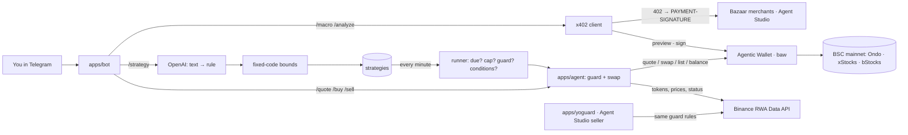

# yostocks

**A Telegram agent for tokenized US stocks on BNB Chain that refuses to trade a bad quote.**

The same stock trades on BSC as three different tokens: Ondo (`NVDAon`), xStocks (`NVDAx`) and bStocks (`NVDAB`).
Their quotes are not equally safe. On mainnet we saw `baw market-order quote` return `success: true` for MSTRx while
paying out **0.000000024 tokens for 100 USDT**, an effective $4.16B per share. An agent that trusts `success` loses
the whole order.

yostocks quotes every provider, converts each quote to a price **per share** (dividend and split `multiplier`
included), compares it with the real US stock price, and only trades the best route that passes. You talk to it in
Telegram, in plain English if you like, and it executes through **Binance Agentic Wallet**.

<p align="center"><code>/buy NVDA 5</code> → guard → ✅ Swap 5 USDT → NVDAB → receipt with BscScan link</p>

## Try it

**Website: [yostocks.xyz](https://yostocks.xyz)** · Open **[@yostocksbot](https://t.me/yostocksbot)** in Telegram. Anyone gets a read-only demo on live mainnet data:

Press **Start** and tap a stock (NVDA, TSLA, AAPL, MSTR, META, GOOGL, SPY, QQQ) or just type a ticker. You get the
real price, the best safe provider in one line, and why the others were skipped, on live mainnet data.

**Trade with your own wallet:** tap a stock, then **🔗 Connect Binance to buy**, and approve in the Binance app
(or scan the QR code). You land back on that stock with the Buy buttons. From then on **Buy**, **Sell** and **💼 My stocks** (value, profit/loss and a PnL chart) run on
your own Agentic Wallet, within the spending limit you set in the app. **🔌 Disconnect** signs the bot out.
Strategies and paid data stay on the owner's wallet.

**While you're away** the agent keeps working in your wallet: **🎯 Buy if it drops** (−3/−5/−10%) and **🎯 Sell higher**
(+5/+10/+20%) place Agentic Wallet limit orders on the bStocks token, with the trigger converted from the per-share
price and checked against the real stock price first. The bot watches them and messages you when one fills, expires or
fails. **🛡 Safety** shows the wallet's daily limit and what's left, how risky trades are handled, and lets you remove
token approvals, but never while an open order still needs them.

## What it does

| | |
|---|---|
| 🛡 **Quote guard** | Every quote → per-share price → must be within ±1% of the reference (US price, or Ondo's oracle price per share off-hours). Rejects ~0-output quotes, paused assets (split, dividend, merger), no-liquidity routes. Picks the cheapest safe provider. |
| 💱 **Buy / sell** | Tap a stock → **Buy $5 / $10 / $25**; **💼 My stocks** → **Sell**. Every tap re-runs the guard at that amount; buttons expire after 60 s and work once. (`/buy`, `/sell`, `/quote` still work for power users.) Polls the order to FINISHED/FAILED, never reports a submission as a fill. |
| 🗣 **Plain-English strategies** | `/strategy buy $10 of NVDA every Monday 9pm WIB, skip earnings, max 0.5% premium` → an LLM (OpenAI `gpt-4o-mini`, strict JSON schema) turns it into a fixed rule shown back in plain words. Code, not the model, enforces bounds; anything the rule can't express ("sell if it drops 10%") is refused, not approximated. |
| 🤖 **Autopilot** | Saved rules run on schedule through the same guard, the rule's conditions (earnings limits, premium cap) and a **daily spend cap** across all strategies. Every run is reported in Telegram. |
| 💳 **Agent pays for its own data (x402)** | `/macro` buys this week's economic calendar from a Bazaar merchant for 0.1 USD1; the agent pays **agent-to-agent over x402** from the Agentic Wallet (402 → preview → user taps Pay → sign once → replay). `/analyze` is wired to BNB Agent Studio's Stock Analyze Agent (paused: it rejects every proof, see below). |
| 🏪 **yoguard (BNB Agent Studio)** | The guard as a seller agent other agents can pay (testnet): ERC-8183 jobs over A2A, JSON in → deterministic verdict out, prose → LLM with a read-only `check_quote` tool. |

## Mainnet proof (BSC)

| What | Tx |
|---|---|
| First buy through the bot: 5 USDT → 0.0224 NVDAB (guard picked bStocks −0.12% over Ondo +0.32%, xStocks had no liquidity; 0.01% slippage) | [`0xfe3a3f…04b9`](https://bscscan.com/tx/0xfe3a3f460a2f278ec91f8dfc550043bf5ed8d9726952bcceb572ace52ef404b9) |
| x402 payment to macropulse (economic calendar), 0.1 USD1, EIP-3009 | [`0xe21fbb…387a`](https://bscscan.com/tx/0xe21fbbfe6d033971d8f12542e858f39a1969586b9161c3a8397dffeb4f76387a) |
| x402 payment to CoinMarketCap MCP (market snapshot), 0.01 U, settled | [`0xff8868…3123`](https://bscscan.com/tx/0xff8868500d6dcd78e8b1c3be02702d9f475f5006197212355a8b4e6b54cd3123) |
| Permit2 approval dispatched by `baw x402-payment sign` (gas-free) | [`0x043a0a…bfd6`](https://bscscan.com/tx/0x043a0a1e99a2f0f977b73e309c0e005a15970061bfffe334948e69d8f900bfd6) |

## How it works



**Modules used:** Binance Web3 RWA Data (token list, dynamic data, asset status, meta/logos), Agentic Wallet CLI
(`market-order quote/swap/list`, `wallet balance/settings/tx-history`, `x402-payment preview/sign`, `auth`),
BNB Agent Studio (`bag` scaffold, ERC-8183 seller over A2A, Pieverse LLM; ERC-8004 identity is registered at deploy), B402 Bazaar
(merchant discovery), Telegram Bot API, OpenAI Responses API.

## What we learned (see [`DX_LOG.md`](DX_LOG.md))

Tokenized stocks on BSC in practice, measured, not assumed:

- **bStocks** has the real PancakeSwap depth (NVDAB ~$3.5M) and quotes 24/7, buy and sell.
- **Ondo** fills via the Binance router at ~reference price, but **refuses sells outside US market hours** (`316008`) while buys still quote and the asset status says `TRADING`.
- **xStocks** mostly has no BSC liquidity; its displayed price can be 21% stale (METAx), and one quote paid ~0 tokens.
- `baw swap` can return an order id that `market-order list` never knows (19 vs 20 digits); we match by token, amount and time.
- x402: CoinMarketCap and macropulse settled from our wallet; the official Stock Analyze Agent returns `payment_rejected` to every proof (U/EIP-3009 and USDT/permit2); `baw` preview rejects multi-network challenges.

## Run it yourself

Node ≥ 22. Indonesian ISPs block `*.binance.com`: use a VPN / Cloudflare WARP.

```sh
npm i -g @binance/agentic-wallet
baw auth signin                      # confirm the pairing code in the Binance App
npm install

cd apps/agent
node yo.mjs quote NVDA 100           # read-only
node yo.mjs buy NVDA 5               # asks before swapping
node yo.mjs sell NVDA                # sells what you hold

cp .env.example .env                 # TELEGRAM_BOT_TOKEN, YO_OWNER_CHAT_ID, OPENAI_API_KEY, BAW
npm start -w apps/bot
```

| env | default | |
|---|---|---|
| `YO_MAX_DEV` | `1` | max % a quote may differ from the reference price |
| `YO_SLIPPAGE` | `1` | swap slippage % |
| `YO_DAILY_CAP` | `50` | USDT the autopilot may spend per UTC day, all strategies |
| `YO_LLM_MODEL` | `gpt-4o-mini` | model for `/strategy` |
| `YO_ANALYST_PAY` | off | `1` re-enables paying the Stock Analyze Agent |

**yoguard** (Agent Studio seller): `npm i -g @bnbagent/studio-cli`, then in `apps/yoguard`: `bag doctor`, `bag dev`.

## Deploy (how @yostocksbot runs)

Coolify on a VPS builds the bot from the root `Dockerfile` and the website from `apps/landing/Dockerfile` (nginx behind the host's TLS proxy at yostocks.xyz); state lives on a persistent volume at `/data`
(wallet session, strategies, paid-report jobs). Runtime secrets: `TELEGRAM_BOT_TOKEN`, `YO_OWNER_CHAT_ID`,
`OPENAI_API_KEY`, and **`BINANCE_INSTANCE_ID`**: any fixed random string. `baw` encrypts its session with a key
derived from it (or from the machine identity, which changes on every container restart), so without it the
wallet signs out on each redeploy. Sign in once inside the container:

```sh
docker exec -it <container> baw auth signin     # open the link, confirm the pairing code in the Binance App
docker exec -it <container> baw auth verify --qrCodeId <id>
```

## Testing

```sh
npm test            # 117 offline tests: unit, regression, integration (agent, bot, yoguard)
npm run test:live   # live: RWA API schema, OpenAI parsing, yoguard A2A
```

Regression tests replay recorded mainnet responses and a fake `baw` for every failure we hit: MSTRx ~0 output,
xStocks no liquidity, METAx stale price, `SESSION_EXPIRED`, the unlistable order id, Ondo's market-hours sell
refusal, the permit2 wait, x402 503/429 handling (never sign twice). Mutation checks confirm the guards are
actually tested: removing any one of them turns the suite red.

## Layout

| | |
|---|---|
| `apps/agent` | guard, swaps, x402 client, data merchants (`yo` CLI). No npm dependencies. |
| `apps/bot` | Telegram bot, strategies, autopilot (`openai`, `zod`). |
| `apps/landing` | [yostocks.xyz](https://yostocks.xyz): Astro + TypeScript static site. |
| `apps/yoguard` | BNB Agent Studio seller agent (`bag init` scaffold + guard). |
| `DX_LOG.md` | timestamped friction log behind our DX report. |
| `probe/` | first research scripts. |

## Limits, honestly

- Each connected wallet is a baw session stored on the bot's server (`/data/wallets/<chat id>`, mode 700). The user's
  funds never leave their wallet, and the session can only spend within the limit set in the Binance app, which can
  also revoke it. Sessions last up to 7 days, then the user connects again. The owner too: 🔌 Disconnect and 🔗 Connect work on the
  server wallet, so re-login never needs shell access.
- One agent session per wallet: connecting the same wallet elsewhere signs the bot out.
- `/analyze` is paused until BNB's Stock Analyze Agent accepts Agentic Wallet payments (#29).
- yoguard sells over ERC-8183 on testnet; paid x402 selling needs B402 merchant credentials whose application form is restricted to the organizer's Google Workspace.
- Not financial advice. Built for BNB Hack: Tokenized Stocks Edition.
